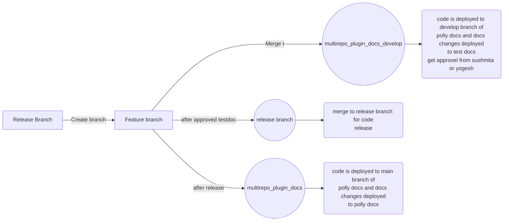

```mermaid
graph LR
A[Release Branch] -- Create branch --> B[Feature branch]
B --Merge to--> C((multirepo_plugin_docs_develop))
B --after approved testdoc--> D((release branch))
B --after release--> E((multirepo_plugin_docs))
C --> F(code is deployed to develop branch of<br>polly docs and docs changes deployed<br>to test docs<br>get approvel from sushmita or yogesh)
D --> G(merge to release branch for code<br>release)
E --> H(code is deployed to main branch of<br>polly docs and docs changes deployed<br>to polly docs)
```
